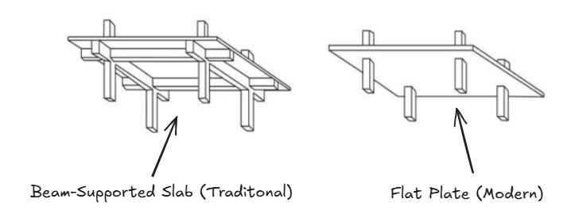
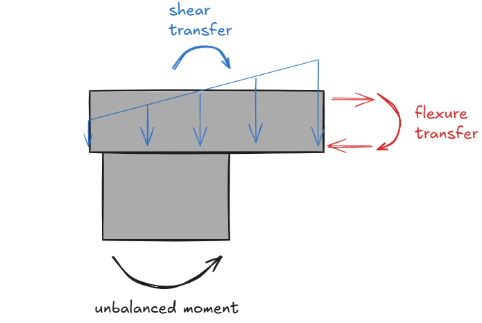
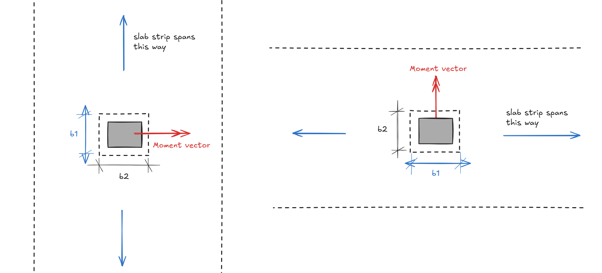
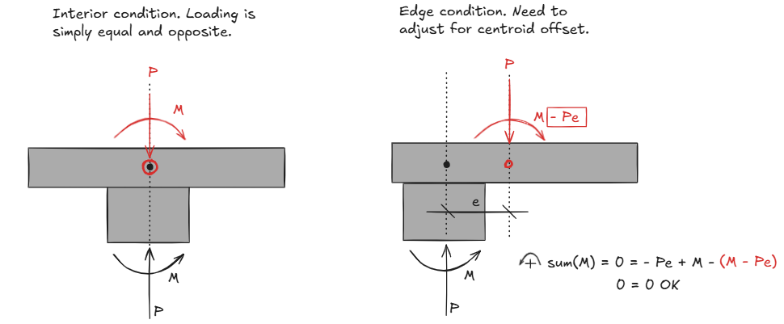
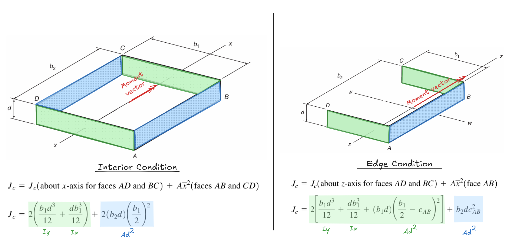

<h1 align="center">
  <br>
  
  <br>
</h1>

<h3 align="center"> Punching Shear Calculation in Python </h3>

<div align="center">
  
</div>


- [Introduction](#introduction)
- [Quick Start](#quick-start)
- [Validation Problems](#validation-problems)
- [Installation](#installation)
- [Usage](#usage)
- [Theoretical Background](#theoretical-background)
- [Assumptions and Limitations](#assumptions-and-limitations)
- [License](#license)


## Introduction

**wthisj** (what the heck is j?) is a python program that calculates punching shear stress around a column. It does so using the elastic method along with concepts described in <u>ACI 318</u> and <u>ACI 421.1R</u>. Refer to the [theoretical background](#theoretical-background) section for more info. Notable features include:

* Supports all column conditions (**interior, edge, and corner**)
* Ability to add **stud rails** (i.e. polygonal shear perimeters)
* Ability to add **openings**
* Interactive result visualization
* Other advanced features like principal orientation rotation, and consideration of moment induced by eccentricity between column and centroid of critical shear perimeter

## Quick Start

Here's the minimum viable script. Define a shear perimeter, run analysis, and visualize results in 3 lines of python code. 

``` python
import wthisj

# initialize a column perimeter
column1 = wthisj.PunchingShearSection(width = 24, height = 24, slab_depth = 12, condition = "I")

# calculate punching shear stress
results = column1.solve(P = -100, Mx = 400, My = 0)

# plot results (plotly)
column1.plot_results_3D()
```

Here is a more comprehensive quick start script found in `main.py`:

```python
import wthisj

# initialize a column perimeter. 
column1 = wthisj.PunchingShearSection(width = 24,
                                      height = 24,
                                      slab_depth = 12,
                                      condition = "W",
                                      overhang_x = 12,
                                      overhang_y = 0,
                                      L_studrail = 36)

# add openings
column1.add_opening(dx=80, dy=-10, width=18, height=20)

# preview geometry
column1.preview()

# calculate punching shear stress
results = column1.solve(P = -100,
                        Mx = 400,
                        My = 400,
                        consider_Pe=False,
                        auto_rotate=False, 
                        verbose=True)

# plot results (matplotlib)
column1.plot_results()

# plot results (plotly)
column1.plot_results_3D()
```

* There are 9 possible conditions (1 interior, 4 edge, 4 corner) denoted using the cardinal directions (NW, N, NE, W, I, E, SW, S, SE). For example, NW is a corner condition with slab edge to the top and left.
* Units should be in **(KIPS, IN)**. 
* Sign convention for the applied force follows the right-hand rule and is illustrated below. Note **P should be negative** unless you are checking uplift. 

<div align="center">
  
</div>


Running the main quick start script will produce the following:

* `PunchingShearSection.preview()` generates a preview of the critical shear perimeter, openings, columns, slab edge, as well as a tabulation of its geometric properties.

<div align="center">
  
</div>

* `PunchingShearSection.solve()` runs an analysis and returns a result dataframe. The critical shear section is discretized numerically into many fibers, each row in the dataframe represents one fiber.

<div align="center">
  
</div>

* `PunchingShearSection.plot_results()` generates a shear stress contour plot + a concise calculation summary.

<div align="center">
  
</div>

* `PunchingShearSection.plot_results_3D()` generates a interactive 3D visualization in html format - viewable in most web browsers.

<div align="center">
  
</div>


## Validation Problems

TODO


## Installation

**Option 1: Anaconda Python**

Run main.py using your base Anaconda environment. 

1. Download Anaconda python
2. Download this package (click the green "Code" button and download zip file)
3. Open and run "main.py" in Anaconda's Spyder IDE.

The following packages are used:

* Numpy
* Pandas
* Matplotlib
* Plotly


**Option 2: Regular Python**

1. Download this project to a folder of your choosing. You can use git, or download one of the tagged releases.
    ```
    git clone https://github.com/wcfrobert/wthisj.git
    ```
2. Change directory into where you downloaded wthisj
    ```
    cd wthisj
    ```
3. Create virtual environment
    ```
    py -m venv venv
    ```
4. Activate virtual environment
    ```
    venv\Scripts\activate
    ```
5. Install requirements
    ```
    pip install -r requirements.txt
    ```
6. run wthisj
    ```
    py main.py
    ```

Pip install is also available.

```
pip install wthisj
```


## Usage

Here are all the public methods available to the user:

### Step 1: Defining a Punching Shear Perimeter

- `PunchingShearSection(width, height, slab_depth, condition, overhang_x=0, overhang_y=0, L_studrail=0, auto_generate_perimeter=True, PATCH_SIZE=0.5)`
- `PunchingShearSection.add_perimeter(start, end, depth)`
- `PunchingShearSection.add_opening(dx, dy, width, height)`
- `PunchingShearSection.rotate(angle)`

### Step 2: Running an Analysis

- `PunchingShearSection.solve(P, Mx, My, gamma_vx="auto", gamma_vy="auto", consider_Pe=True, auto_rotate=True, verbose=True)`


### Step 3: Plotting Results

- `PunchingShearSection.preview()`
- `PunchingShearSection.plot_results(colormap="jet", cmin="auto", cmax="auto")`
- `PunchingShearSection.plot_results_3D(colormap="jet", cmin="auto", cmax="auto", scale=10)`

If you need guidance at any time, use the help() command to access method docstrings. For example, here is the output for `help(wthisj.PunchingShearSection.add_opening)`

<div align="center">
  
</div>


### Define Shear Perimeter

**`PunchingShearSection(width, height, slab_depth, condition, overhang_x=0, overhang_y=0, L_studrail=0, auto_generate_perimeter=True, PATCH_SIZE=0.5)`** - Instantiate and return a PunchingShearSection object.

* width: float
  * Column dimension along x-axis

* height: float
  * Column dimension along y-axis

* slab_depth: float
  * Slab depth from outermost compression fiber to outermost tension rebar. Use the average depth of two orthogonal slab directions.

* condition: string
  * String used to specify interior, edge, or corner column condition. Valid inputs look like the cardinal directions on a compass.
  * "N", "S", "W", "E", "NW", "NE", "SW", "SE"
  * For example, "NW" is a corner condition with slab edge to the top left. "W" is an edge condition with slab edge on the left.

* overhang_x: float (OPTIONAL)
  * Default = 0
  * Slab overhang dimension along the X-axis beyond column face.
  * Based on CRSI recommendations, overhang exceeding b/2 + d are treated as interior condition (where d is the slab depth, and b is the column dimension perpendicular to the edge).

* overhang_y: float (OPTIONAL)
  * Default = 0
  * Slab overhang dimension along the Y-axis beyond column face.
  * Based on CRSI recommendations, overhang exceeding b/2 + d are treated as interior condition (where d is the slab depth, and b is the column dimension perpendicular to the edge).

* L_studrail: float (OPTIONAL)
  * Default = 0
  * Stud rails may be added to expand the punching shear perimeter into a polygonal pattern. The exact geometry is described in ACI 318-19. We will assume stud rails always exist at the column corners, and that a minimum of two rails exist on each face. Parameters like spacing and number of stud rails are irrelevant here because all we care about is the perimeter geometry (wthisj does NOT calculate any shear capacities!)

* auto_generate_perimeter: bool (OPTIONAL)
  * Default = True
  * Automatically generate the punching shear perimeter based on the arguments entered by the user above. Alternatively, the user may set this parameter to False, then draw each perimeter line manually using the `.add_perimeter()` method.

* PATCH_SIZE: float (OPTIONAL)
  * Default = 0.5
  * By default, the shear perimeter is numerically discretized into 0.5" fibers. You can specify a smaller fiber size to improve accuracy. 0.5" is small enough for most cases.

```python
# define a top-left corner column (24"x24") supporting a slab with rebar depth of 12". 
# Add 36" long stud rails on the inner faces. Slab overhang is 12" in both directions.
column1 = wthisj.PunchingShearSection(width = 24,
                                      height = 24,
                                      slab_depth = 12,
                                      condition = "NW",
                                      overhang_x = 12,
                                      overhang_y = 12,
                                      L_studrail = 36)
```


### Add Openings

**`PunchingShearSection.add_opening(dx, dy, width, height)`** - Add a rectangular opening nearby. The column center is always located at (0,0). Specify bottom left corner of opening as well as opening size. This method modifies the PunchingShearSection object internally and does not return anything.

* dx: float
  * x-offset from column center (0,0) to the bottom left corner of opening
* dy: float
  * y-offset from column center (0,0) to the bottom left corner of opening
* width: float
  * opening width
* height: float
  * opening height


```python
# add a 18" x 20" opening with bottom-left corner located 80" left and 10" below the column center.
column1.add_opening(dx=80, dy=-10, width=18, height=20)
```


### Run Analysis

**`PunchingShearSection.solve(P, Mx, My, gamma_vx="auto", gamma_vy="auto", consider_Pe=True, auto_rotate=True, verbose=True)`** - Start analysis routine. Returns a dataframe where each row is a fiber within the shear perimeter, and the columns are the intermediate calculation results. 

* P: float
  * Applied shear force in KIPS. Should be NEGATIVE unless you are checking uplift
* Mx: float
  * Applied moment about the X-axis in KIP.IN.
* My: float
  * Applied moment about the Y-axis in KIP.IN.
* gamma_vx: float or string (OPTIONAL)
  * Percentage of X moment transferred to the column via shear. wthisj will automatically calculate this. Or the user may enter a specific value of gamma_vx (e.g. 0.4)
* gamma_vy: float or string (OPTIONAL)
  * Percentage of Y moment transferred to the column via shear. wthisj will automatically calculate this. Or the user may enter a specific value of gamma_vy (e.g. 0.4)
* consider_Pe: bool (OPTIONAL)
  * Whether or not to consider additional moment due to eccentricity between the column centroid and perimeter centroid. Defaults to True. Refer to the theory section for more info!
* auto_rotate: bool (OPTIONAL)
  * Whether or not to auto-rotate geometry if it is not in principal orientation. Please note equilibrium is only maintained for sections in its principal orientation. Superposition of stress due to bi-axial moment is only valid when Ixy = 0. Refer to the theoretical background section for more info.
* verbose: bool (OPTIONAL)
  * Whether or not to printout calculation result and other helpful messages. Default = True.


```python
# Check punching shear stress for a perimeter subjected to 100 kips of shear, 400 kips.in of moment in both directions.
# Do not rotate the section to principal orientation.
# Do not consider additional moment due to eccentricity between column and perimeter centroid.
results = column1.solve(P = -100,
                        Mx = 400,
                        My = 400,
                        consider_Pe=False,
                        auto_rotate=False, 
                        verbose=True)
```


### Preview Geometry

**`PunchingShearSection.preview()`** - Preview critical shear perimeter, openings, slab edges, and other surrounding contexts. Geometric properties like $b_o$ and $I_x$ are also shown. This method returns a matplotlib fig object.

* No argument necessary.

```python
# visualize what the shear perimeter looks like
fig1 = column1.preview()
```


### Visualize Results - 2D

**`PunchingShearSection.plot_results(colormap="jet", cmin="auto", cmax="auto")`** - Visualize punching shear calculation results and stress contour. This method returns a matplotlib fig object.

* colormap: string (OPTIONAL)
  * named colormap. Here's a [list of all available colormaps](https://matplotlib.org/stable/gallery/color/colormap_reference.html). "jet" is a common one for stress visualization.
* cmin: float or string (OPTIONAL)
  * specify min range for color mapping. Default = min(stress)
* cmax: float or string (OPTIONAL)
  * specify max range for color mapping. Default = max(stress)

```python
# visualize shear stress plot. Use the "turbo" colormap instead 
# set cmax to 160 psi so that anything higher is colored red
fig2 = column1.plot_results(colormap="turbo", cmax=160)
```


### Visualize Results - 3D

**`PunchingShearSection.plot_results_3D(colormap="jet", cmin="auto", cmax="auto", scale=10)`** - Visualize punching shear calculation results in an interactive 3D format using plotly. This method returns a plotly figure object.


* colormap: string (OPTIONAL)
  * named colormap. Here's a [list of all available colormaps](https://matplotlib.org/stable/gallery/color/colormap_reference.html). "jet" is a common one for stress visualization.
* cmin: float or string (OPTIONAL)
  * specify min range for color mapping. Default = min(stress)
* cmax: float or string (OPTIONAL)
  * specify max range for color mapping. Default = max(stress)
* scale: float (OPTIONAL)
  * scaling factor used to adjust the size of vector plot. Default is 10. Which means the max vector is 10" in the Z-dimension.


```python
# visualize shear stress. Use the "plasma" colormap
# change scale to 5 so the stress vectors are not too large.
fig3 = column1.plot_results_3D(colormap="plasma", scale=5)
```


### Advanced Features

**`PunchingShearSection.add_perimeter(start, end, depth)`** - Draw a shear perimeter line. This is an advanced feature for users who wish to draw highly customized shear perimeter. Not needed in most cases because the `auto_generate_perimeter` parameter is set to True during initialization, and a perimeter is automatically generated. This method modifies the PunchingShearSection object internally and does not return anything.

* start: [float]
  * [x, y] coordinate of the start point
* end: [float]
  * [x, y] coordinate of the end point
* depth: float
  * slab depth along this line


```python
# define a 18" x 18" column, but turn auto-generate perimeter off
column1 = wthisj.PunchingShearSection(width = 18,
                                      height = 18,
                                      slab_depth = 12,
                                      condition = "I",
                                      auto_generate_perimeter = False)

# draw a custom perimeter where one side has a slab depth of 6" rather than 12"
column1.add_perimeter(start=[-15,-15], end=[-15,15], depth=12)
column1.add_perimeter(start=[-15,15], end=[12,15], depth=12)
column1.add_perimeter(start=[12,15], end=[12,-15], depth=6)
column1.add_perimeter(start=[12,-15], end=[-15,-15], depth=12)
```

**`PunchingShearSection.rotate(angle)`** - Rotate the section by a specified angle. This is an advanced feature not needed in most cases because the `auto_rotate` argument in `.solve()` is set to True by default. In other words, sections will automatically be rotated to its principal orientation. Please note equilibrium is only maintained for sections in its principal orientation. Superposition of stress due to bi-axial moment is only valid when Ixy = 0. Refer to the theoretical background section for more info. This method modifies the PunchingShearSection object internally and does not return anything.

* angle: float
  * rotate shear perimeter by a specified **DEGREE** measured counter clockwise from the +X axis.


```python
# rotate the column by 45 degrees counter-clockwise from +X axis.
column1.rotate(angle=45)
```


## Theoretical Background

### 1.0 Introduction

Two-way shear - known colloquially as punching shear - is a load transfer mechanism between concrete slabs and its supporting columns. This type of load transfer is unique to a special type of floor system called **flat plate** (or flat slab where drop panel or column caps are present). In a flat plate system, the slab is supported directly by columns; no beams, no girders, just a smooth monolithic plate.

In the figure below, we see two types of concrete floor systems. The one on the left is more traditional, whereby the slab is supported by intersecting beams, which then transfer the load to the columns. The modern approach, shown on the right, has a completely flat soffit without any beams.

<p align="center"></p>

It is easy to see why beam-supported slab systems have fallen out of favor. Beams and girders must be shaped with formwork, which means more carpentry work, which means more labor, higher cost, and longer construction time. On the other hand, flat plate slabs are easier to build, reduce complexity in terms of detailing, give MEP trade partners full flexibility in the ceiling space, and minimize formwork (see [flying form](https://www.concrete.org.uk/fingertips-nuggets.asp?cmd=display&id=536)). Furthermore, the shallow floor depths means more floors can fit within the same building height constraint. This is a no-brainer decision for developers. Most concrete high-rises in the US today have flat plate floor systems. 

So what is the trade-off? The lack of supporting beams means **less redundancy** and **high shear stress** around the supporting columns. If improperly design, flat plates can fail like a pencil through paper, and if the slab fails, it's game over. The figure below is an illustration of punching shear failure. The photo on the left is a garage in the UK (Piper's Row Car Park, Wolverhampton) built in the 1960s. Needless to say, the accurate evaluation of punching shear has become critically important in concrete slab design.

<p align="center"></p>

### 2.0 Punching Shear Per ACI-318

The evaluation of punching shear is conceptually simple (for now... we will introduce more nuances later on). The shear stress is simply equal to the shear load transferred to the column divided by the area of the failure plane. This failure plane is technically an inverted truncated cone. To simplify, ACI-318 allows the **critical** **shear perimeter** to be approximated as four rectangular faces offset d/2 from the column face (shown in dotted line below).

<p align="center"></p>

Therefore, the total shear area is equal to the perimeter ($b_o$) times the slab depth ($d$). Note slab depth is measured from the extreme compression fiber to tension rebar (taking the average depth of the two-orthogonal rebar directions).

$$A_v = b_o d$$

Therefore, the punching shear stress, **assuming negligible moment transfer**, is equal to the total shear demand ($V_u$) on the column, divided by the shear area. Concrete design is very empirical which is why we only care about the average shear stress.

$$v_u = \frac{V_u}{b_od}$$

In practice, the equation above is only good for preliminary estimates. Moment transfers are always present, and can arise from unequal spans, uneven load distribution, uneven stiffness, and many other reasons. It is not reasonable to assume zero moment transfer, especially at edge and corner columns. Concrete buildings are monolithic after all - there is no such thing as pinned in concrete design. 

To account for the effect of moment transfer, ACI-318 provides an equation that is vaguely reminiscent of the combined stress formulas we see in college textbooks ($P/A + Mc/I$), but not exactly. Below is an illustration of the superposition of shear stresses from the [Macgregor Textbook](https://www.amazon.com/Reinforced-Concrete-Mechanics-Design-6th/dp/0132176521) (slightly modified). As an aside, this textbook is my all time favorite. I'm a huge fan of Dr. MacGregor, not least because he is also Canadian.

$$v_u = \frac{V_u}{b_o d} \pm \frac{\gamma_v M_{sc} c}{J_c}$$

<p align="center"></p>

Let's go through the variables in the second term one-by-one.

**Unbalanced Moment ($M_{sc}$)**

The slab moment transferred into the supporting column is known as **unbalanced moment** ($M_{sc}$). The reason it is called "unbalanced" is because of the vertical offsets present in the slab moment diagram. I don't like this naming because everything is balanced for static equilibrium. If we plot the moment diagram for the entire floor assembly, we see exactly where that unbalanced moment is going: into the columns. 

<p align="center"></p>

**Moment Transfer Ratio ($\gamma$)**

The unbalanced moment described above can transfer into the columns in two ways:

* Flexure within a limited transfer widths ($\gamma_f$)
* Shear ($\gamma_v$)


<p align="center"></p>

We use the Greek letter ($\gamma$) to denote the percentage of moment transferred through each mode. Taken together, the two modes of transfer should add up to 100% (i.e. $\gamma_v + \gamma_f = 1.0$). The proportion of moment transferred by shear ($\gamma_v M_{sc}$) is of interest to us because it will amplify shear stress. ACI-318 has equations for estimating $\gamma_f$ and $\gamma_v$ based on the critical shear section dimension.

$$\gamma_f = \frac{1}{1+2/3\sqrt{\frac{b_1}{b_2}}}$$

$$\gamma_v = 1 - \gamma_f$$

For example, a square column would have a moment transfer ratio of 60% through flexure, and 40% through shear. $b_1$ is the critical perimeter dimension parallel to the slab span, whereas $b_2$ is the critical perimeter dimension perpendicular to the slab span. See figure below for an illustration. 

<p align="center"></p>

**Distance From Perimeter Centroid ($c$)**

The parameter c is the distance from the centroid to any fiber in the parameter. This distance is measured orthogonal to the applied moment vector. We usually only care about the fiber furthest away where the shear stress will be highest. It should be noted that the critical shear perimeter's centroid does not always coincide with the column's centroid, we will discuss this offset in a later section.

<p align="center"></p>

**"Polar Moment of Inertia" ($J_c$)**

$J_c$ is often referred to as a "section property analogous to polar moment of inertia". There are many design tables and formulas to help you calculate J. Rather than just giving you some formulas, let's go through the derivations step-by-step. The calculation procedure for J is vaguely reminiscent of calculating section properties with the composite area formulas and parallel axis theorem, with a few idiosyncrasies that I will highlight. Before proceeding further, I'll assume a basic grasp of [second moment of area](https://en.wikipedia.org/wiki/Second_moment_of_area) and related concepts.

First, we break the 3-D shear perimeter into individual rectangular areas:

* For the areas **perpendicular** to the moment vector (highlighted green below), we add up its $I_x$ and $I_y$ as well as any $Ad^2$ terms if applicable. I think of this area as the "**web**".
* For the areas **parallel** with the moment vector (highlighted blue below), we calculate only its $A d^2$ term and ignore the rest. I think of this area as the "**flange**".

<p align="center"></p>

This is a little convoluted. Here's how I remember what to do: **calculate $I_x$, $I_y$, and $Ad^2$ for the "web" area, then calculate $Ad^2$ terms for the "flange" areas.**

For example, let's look at the interior condition in the figure above. For the two flange areas highlighted in blue, we only count the $A d^2$ term:

$$Ad^2 = (b_2 d) (b_1/2)^2$$

For the two web areas highlighted in green, we count both the the  $I_x$ and $I_y$ term. Because the centroid of green rectangle coincide with the centroid of the shear perimeter, we do not need to consider an additional $A d^2$ term (because d is 0).

$$I_x = \frac{d b_1^3}{12}$$

$$I_y = \frac{b_1 d^3}{12}$$

Finally, putting all the pieces together, we arrive at the same equation as above:

$$J_c = 2(\frac{d b_1^3}{12}+\frac{b_1 d^3}{12}) + 2(b_2 d) (b_1/2)^2$$

We now have all the pieces to calculate the punching shear stress. Here is the ACI formula again. 

$$v_u = \frac{V_u}{b_o d} \pm \frac{\gamma_v M_{sc} c}{J_c}$$


Please note that although there is a $\pm$ for the second term, unbalanced moment is usually not symmetrical where both negative and positive magnitudes are possible. Consider an edge column, the unbalanced moment is always on one-side!


### 3.0 Adding Complexity

Hopefully the previous section is not too confusing, if so, it is only going to get worse. In practice, the formulations above are easily strained by real-life design scenarios. Let's muddy the water a little bit.

**Complexity #1: Why Is $J$ a Polar Moment of Inertia?**

Despite the name "polar moment of inertia", the $J_c$ term is just a regular moment of inertia, at least in the way it is used. In any mechanics of material textbooks, polar moment of inertia ($I_z$ or $J$) is introduced as a property associated with in-plane torsion. For any section, there is only one possible $I_z$. On the other hand, the planar moments of inertia are introduces as properties associated with out-of-plane flexure and can occur about two orthogonal axes ($I_x$ and $I_y$) . 

The use of $J$ to represent non-polar moment of inertia in concrete design is an incredibly confusing anti-pattern. If we refer to concrete design guides, we see that it is indeed possible to calculate an $J_c$ for both orthogonal axes. Here's $J_{cx}$ and $J_{cy}$ for an interior condition.

$$J_{cx} = 2(\frac{d b_1^3}{12}+\frac{b_1 d^3}{12}) + 2(b_2 d) (b_1/2)^2$$

$$J_{cy} = 2(\frac{d b_2^3}{12}+\frac{b_2 d^3}{12}) + 2(b_1 d) (b_2/2)^2$$


**Complexity #2: What About Unbalanced Moment About Both Axes?**

The natural follow up question is if we ever need to calculate both $J_{cx}$ and $J_{cy}$. There [has been plenty of debate](https://www.eng-tips.com/threads/punching-shear-aci-calculation-method.392228/) on whether unbalanced moment about both principal axes should be considered at the same time, or one axis at a time and take the worst. Based on the Eng-Tip discussion linked above, it seems like considering bi-axial moment will yield the maximum stress at a point, whereas all the experimental tests and thus code-based equations are based on the average stress across an entire face. According to the ACI committee 421 report in 1999 (ACI 421.1R-99), an overstress of 15% is assumed to be acceptable as stress is expected to distribute away from the highly stressed corners of the critical perimeter. However, this statement mysteriously disappeared in the latest version of the report (ACI 421.1R-20). I'll leave the engineering judgement to the reader.

Here's the full shear stress equation if we were to consider moment about both axes.

$$v_u = \frac{V_u}{b_o d} \pm \frac{\gamma_{vx} M_{sc,x} c_y}{J_{cx}} \pm \frac{\gamma_{vy} M_{sc,y} c_x}{J_{cy}}$$


**Complexity #3: What About Nearby Openings?**


**Complexity #4: What About Edge Conditions With Large Overhang?**


**Complexity #5: How To Calculate J for Section With Slanted Surfaces?**


**Complexity #6: Corner Column Principal Orientation?**


**Complexity #7: Offset Between Column Centroid and Critical Section Centroid?**


### 4.0 Background Info on J


### 5.0 Elastic Method


### 6.0 Numerical Approximation with wthisj


### 7.0 What About Allowable Shear Capacity?


I've written in great length about how to determine the shear stress **demand**. But what about allowable shear **capacity**? Unfortunately, I will not be covering capacity in detail here. Concrete strength is mostly empirical and based on experimental testing. I don't think there's anything theoretically interesting. In general, the building code specifies an allowable shear stress ranging from $2\sqrt{f'_c}$ to  $4\sqrt{f'_c}$

Wthisj will not calculate punching shear capacity. Please refer to the building code for more guidance. 


## Assumptions and Limitations

TODO

* units, difference in J formulation, numerical approximation, max stress at point vs surface


## License

MIT License

Copyright (c) 2025 Robert Wang
