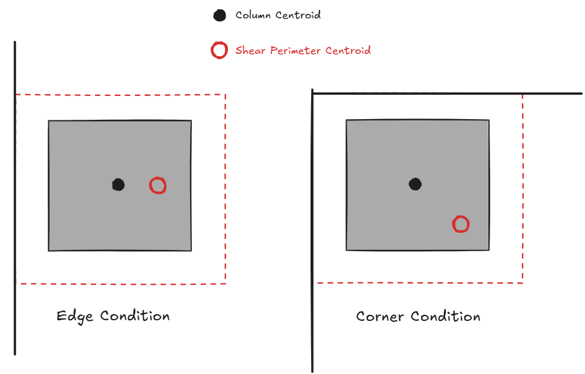

<h1 align="center">
  <br>
  
  <br>
</h1>

<h3 align="center"> Punching Shear Calculation in Python </h3>

<div align="center">
  
</div>


- [Introduction](#introduction)
- [Quick Start](#quick-start)
- [Installation](#installation)
- [Usage](#usage)
- [Theoretical Background](#theoretical-background)
- [Assumptions and Limitations](#assumptions-and-limitations)
- [License](#license)


## Introduction

**wthisj** (what the heck is j?) is a python program that that performs punching shear calculations based on the concepts described in ACI 318. Create a critical shear section, add loads, and visualize results in less than 3 lines of python code.

Notable Features:

* All column conditions (interior, edge, and corner)
* Add stud rails (i.e. polygonal shear perimeters)
* Add openings
* Interactive visualization of shear stresses
* Advanced features like principal axes rotation, consideration moment due to centroid eccentricity, non-uniform depth shear perimeters, numerical approximation of $J_{cx}$ and $J_{cy}$ for any arbitrary sections.


## Quick Start

Here's the minimum viable script. 

``` python
import wthisj

# initialize a critical shear section
column1 = wthisj.PunchingShearSection(col_width=24, col_depth=24, slab_avg_depth=12, condition="I")

# calculate punching shear stress
results = column1.solve(Vz = -100, Mx = 400, My = 0)

# plot results
column1.plot_results()
```

Here's a more comprehensive quick start script found in `main.py`:

```python
import wthisj

# initialize a critical shear section
column1 = wthisj.PunchingShearSection(col_width = 24,
                                      col_depth = 24,
                                      slab_avg_depth = 12,
                                      condition = "NW",
                                      overhang_x = 12,
                                      overhang_y = 12,
                                      studrail_length = 0)

# add as many openings as you want
column1.add_opening(xo=40, yo=-10, width=18, depth=20)

# preview geometry
column1.preview()

# calculate punching shear stress
results = column1.solve(Vz = -100,
                        Mx = 400,
                        My = 400,
                        consider_ecc=False,
                        auto_rotate=True, 
                        verbose=True)

# plot results (matplotlib)
column1.plot_results()

# plot results (plotly)
column1.plot_results_3D()

```

* There are 9 possible conditions (1 interior, 4 edge, 4 corner), each represented using the cardinal directions on a compass (NW, N, NE, W, I, E, SW, S, SE), except "I" which stands for interior. For example, "NW" represents a top-left corner column.
* Units should be in **(KIPS, IN)**. 
* Sign convention for the applied forces should follow the right-hand rule. Note **Vz should be negative** unless you are checking uplift. 

<div align="center">
  
</div>


Running the main quick start script will produce the following:

* `PunchingShearSection.preview()` generates a preview of the critical shear perimeter, openings, columns, slab edge, as well as a tabulation of its geometric properties.

<div align="center">
  
</div>

* `PunchingShearSection.solve()` runs an analysis and returns a result dataframe. The critical shear section is discretized numerically into many fibers, each row in the data frame represents one fiber. Key calculation results will be printed to console if `verbose` is set to True.

<div align="center">
  
</div>


<div align="center">
  
</div>


* `PunchingShearSection.plot_results()` generates a shear stress contour plot + a concise calculation summary.

<div align="center">
  
</div>

* `PunchingShearSection.plot_results_3D()` generates a interactive 3D visualization in html format - viewable in most web browsers.

<div align="center">
  
</div>


## Installation

**Option 1: Anaconda Python**

Run main.py using your base Anaconda environment. 

1. Download Anaconda python
2. Download this package (click the green "Code" button and download zip file)
3. Open and run "main.py" in Anaconda's Spyder IDE.

The following packages are used:

* Numpy
* Pandas
* Matplotlib
* Plotly


**Option 2: Regular Python**

1. Download this project to a folder of your choosing. You can use git, or download one of the tagged releases.
    ```
    git clone https://github.com/wcfrobert/wthisj.git
    ```
2. Change directory into where you downloaded wthisj
    ```
    cd wthisj
    ```
3. Create virtual environment
    ```
    py -m venv venv
    ```
4. Activate virtual environment
    ```
    venv\Scripts\activate
    ```
5. Install requirements
    ```
    pip install -r requirements.txt
    ```
6. run wthisj
    ```
    py main.py
    ```

Pip install is also available.

```
pip install wthisj
```


## Usage

Here are all the public methods available to the user:

- `PunchingShearSection(col_width, col_height, slab_avg_depth, condition, overhang_x=0, overhang_y=0, studrail_length=0, auto_generate_perimeter=True, PATCH_SIZE=0.5)`
- `PunchingShearSection.add_perimeter(start, end, depth)`
- `PunchingShearSection.add_opening(xo, yo, width, depth)`
- `PunchingShearSection.rotate(angle)`

- `PunchingShearSection.solve(Vz, Mx, My, gamma_vx="auto", gamma_vy="auto", consider_ecc=False, auto_rotate=True, verbose=True)`

- `PunchingShearSection.preview()`
- `PunchingShearSection.plot_results(colormap="jet", cmin="auto", cmax="auto")`
- `PunchingShearSection.plot_results_3D(colormap="jet", cmin="auto", cmax="auto", scale=10)`

If you need guidance at any time, use the help() command to access method docstrings. For example, here is the output for `help(wthisj.PunchingShearSection.add_opening)`

<div align="center">
  
</div>


### Define Shear Perimeter

**`PunchingShearSection(col_width, col_depth, slab_avg_depth, condition, overhang_x=0, overhang_y=0, studrail_length=0, auto_generate_perimeter=True, PATCH_SIZE=0.5)`** - Instantiate and return a PunchingShearSection object.

* col_width: float
  * Column dimension along x-axis

* col_depth: float
  * Column dimension along y-axis

* slab_avg_depth: float
  * Slab depth from outermost compression fiber to outermost tension rebar. Use the average depth of two orthogonal slab directions.

* condition: string
  * String used to specify interior, edge, or corner column condition. Valid inputs look like the cardinal directions on a compass.
  * "N", "S", "W", "E", "NW", "NE", "SW", "SE"
  * For example, "NW" is a corner condition with slab edge to the top left. "W" is an edge condition with slab edge on the left.

* overhang_x: float (OPTIONAL)
  * Default = 0
  * Slab overhang dimension along the X-axis beyond column face.
  * Based on CRSI recommendations, overhang exceeding b/2 + d are treated as interior condition (where d is the slab depth, and b is the column dimension perpendicular to the edge).

* overhang_y: float (OPTIONAL)
  * Default = 0
  * Slab overhang dimension along the Y-axis beyond column face.
  * Based on CRSI recommendations, overhang exceeding b/2 + d are treated as interior condition (where d is the slab depth, and b is the column dimension perpendicular to the edge).

* studrail_length: float (OPTIONAL)
  * Default = 0
  * Stud rails may be added to expand the punching shear perimeter into a polygonal pattern. The exact geometry is described in ACI 318-19. We will assume stud rails always exist at the column corners, and that a minimum of two rails exist on each face. Parameters like spacing and number of stud rails are irrelevant here because all we care about is the perimeter geometry (wthisj does NOT calculate any shear capacities!)

* auto_generate_perimeter: bool (OPTIONAL)
  * Default = True
  * Automatically generate the punching shear perimeter based on the arguments entered by the user above. Alternatively, the user may set this parameter to False, then draw each perimeter line manually using the `.add_perimeter()` method.

* PATCH_SIZE: float (OPTIONAL)
  * Default = 0.5
  * By default, the shear perimeter is numerically discretized into 0.5" fibers. You can specify a smaller fiber size to improve accuracy. 0.5" is small enough for most cases.

```python
# define a top-left corner column (24"x24") supporting a slab with rebar depth of 12". 
# Add 36" long stud rails on the inner faces. Slab overhang is 12" in both directions.
column1 = wthisj.PunchingShearSection(col_width = 24,
                                      col_deptht = 24,
                                      slab_avg_depth = 12,
                                      condition = "NW",
                                      overhang_x = 12,
                                      overhang_y = 12,
                                      studrail_length = 36)
```


### Add Openings

**`PunchingShearSection.add_opening(xo, yo, width, depth)`** - Add a rectangular opening nearby. The column center is always located at (0,0). Specify bottom left corner of opening as well as opening size. This method modifies the PunchingShearSection object internally and does not return anything.

* xo: float
  * x-offset from column center (0,0) to the bottom left corner of opening
* yo: float
  * y-offset from column center (0,0) to the bottom left corner of opening
* width: float
  * opening width
* depth: float
  * opening height


```python
# add a 18" x 20" opening with bottom-left corner located 80" left and 10" below the column center.
column1.add_opening(xo=80, yo=-10, width=18, depth=20)
```


### Run Analysis

**`PunchingShearSection.solve(Vz, Mx, My, gamma_vx="auto", gamma_vy="auto", consider_ecc=False, auto_rotate=True, verbose=True)`** - Start analysis routine. Returns a dataframe where each row is a fiber within the shear perimeter, and the columns are the intermediate calculation results. 

* Vz: float
  * Applied shear force in KIPS. Should always be NEGATIVE unless you are checking uplift
* Mx: float
  * Applied moment about the X-axis in KIP.IN.
* My: float
  * Applied moment about the Y-axis in KIP.IN.
* gamma_vx: float or string (OPTIONAL)
  * Percentage of X moment transferred to the column via shear. wthisj will automatically calculate this. Or the user may enter a specific value of gamma_vx (e.g. 0.4)
* gamma_vy: float or string (OPTIONAL)
  * Percentage of Y moment transferred to the column via shear. wthisj will automatically calculate this. Or the user may enter a specific value of gamma_vy (e.g. 0.4)
* consider_ecc: bool (OPTIONAL)
  * Whether or not to consider additional moment due to eccentricity between the column centroid and perimeter centroid. Defaults to True. Refer to the theory section for more info!
* auto_rotate: bool (OPTIONAL)
  * Whether or not to auto-rotate geometry if it is not in principal orientation. Please note equilibrium is only maintained for sections in its principal orientation. Superposition of stress due to bi-axial moment is only valid when Ixy = 0. Refer to the theoretical background section for more info.
* verbose: bool (OPTIONAL)
  * Whether or not to printout calculation result and other helpful messages. Default = True.


```python
# Check punching shear stress for a perimeter subjected to 100 kips of shear, 400 kips.in of moment in both directions.
# Not rotating the section to principal orientation.
# Not considering additional moment due to eccentricity between column and perimeter centroid.
results = column1.solve(Vz = -100,
                        Mx = 400,
                        My = 400,
                        consider_ecc=False,
                        auto_rotate=False, 
                        verbose=True)
```


### Preview Geometry

**`PunchingShearSection.preview()`** - Preview critical shear perimeter, openings, slab edges, and other surrounding contexts. Geometric properties like $b_o$ and $I_x$ are also shown. This method returns a matplotlib fig object.

* No argument necessary.

```python
# visualize what the shear perimeter looks like
fig1 = column1.preview()
```


### Visualize Results - 2D

**`PunchingShearSection.plot_results(colormap="jet", cmin="auto", cmax="auto")`** - Visualize punching shear calculation results and stress contour. This method returns a matplotlib fig object.

* colormap: string (OPTIONAL)
  * named colormap. Here's a [list of all available colormaps](https://matplotlib.org/stable/gallery/color/colormap_reference.html). "jet" is a common one for stress visualization.
* cmin: float or string (OPTIONAL)
  * specify min range for color mapping. Default = min(stress)
* cmax: float or string (OPTIONAL)
  * specify max range for color mapping. Default = max(stress)

```python
# visualize shear stress plot. Use the "turbo" colormap instead 
# set cmax to 160 psi so that anything higher is colored red
fig2 = column1.plot_results(colormap="turbo", cmax=160)
```


### Visualize Results - 3D

**`PunchingShearSection.plot_results_3D(colormap="jet", cmin="auto", cmax="auto", scale=10)`** - Visualize punching shear calculation results in an interactive 3D format using plotly. This method returns a plotly figure object.


* colormap: string (OPTIONAL)
  * named colormap. Here's a [list of all available colormaps](https://matplotlib.org/stable/gallery/color/colormap_reference.html). "jet" is a common one for stress visualization.
* cmin: float or string (OPTIONAL)
  * specify min range for color mapping. Default = min(stress)
* cmax: float or string (OPTIONAL)
  * specify max range for color mapping. Default = max(stress)
* scale: float (OPTIONAL)
  * scaling factor used to adjust the size of vector plot. Default is 10. Which means the max vector is 10" in the Z-dimension.


```python
# visualize shear stress. Use the "plasma" colormap
# change scale to 5 so the stress vectors are not too large.
fig3 = column1.plot_results_3D(colormap="plasma", scale=5)
```


### Advanced Features

**`PunchingShearSection.add_perimeter(start, end, depth)`** - Draw a line of shear perimeter. This is an advanced feature for users who wish to draw highly customized perimeter, such as ones with non-uniform depths. This is not needed in most cases because the `auto_generate_perimeter` parameter is set to True during initialization, and a perimeter is automatically generated. This method modifies the PunchingShearSection object internally and does not return anything.

* start: [float]
  * [x, y] coordinate of the start point
* end: [float]
  * [x, y] coordinate of the end point
* depth: float
  * slab depth along this line


```python
# define a 18" x 18" column, but turn auto-generate perimeter off
column1 = wthisj.PunchingShearSection(width = 18,
                                      height = 18,
                                      slab_depth = 12,
                                      condition = "I",
                                      auto_generate_perimeter = False)

# draw a custom perimeter where one side has a slab depth of 6" rather than 12"
column1.add_perimeter(start=[-15,-15], end=[-15,15], depth=12)
column1.add_perimeter(start=[-15,15], end=[12,15], depth=12)
column1.add_perimeter(start=[12,15], end=[12,-15], depth=6)
column1.add_perimeter(start=[12,-15], end=[-15,-15], depth=12)
```

**`PunchingShearSection.rotate(angle)`** - Rotate the section by a specified angle. This is an advanced feature not needed in most cases because the `auto_rotate` argument in `.solve()` is set to True by default. In other words, sections will automatically be rotated to its principal orientation. Please note equilibrium is only maintained for sections in its principal orientation. Superposition of stress due to bi-axial moment is only valid when Ixy = 0. Refer to the theoretical background section for more info. This method modifies the PunchingShearSection object internally and does not return anything.

* angle: float
  * rotate shear perimeter by a specified **DEGREE** measured counter clockwise from the +X axis.


```python
# rotate the column by 45 degrees counter-clockwise from +X axis.
column1.rotate(angle=45)
```


## Theoretical Background

### 1.0 Introduction

Two-way shear - known colloquially as punching shear - is a load transfer mechanism between concrete slabs and its supporting columns. This type of load transfer is unique to a special type of floor system called **flat plate** (or flat slab where drop panels or column caps are present). In a flat plate system, the slab is supported directly by columns; no beams, no girders, just a smooth monolithic plate.

In the figure below, we see two types of concrete floor systems. The one on the left is more traditional, whereby the slab is supported by intersecting beams, which then transfer the loads to the columns. The modern approach, shown on the right, has a completely flat soffit without any beams.

<p align="center"></p>

It is easy to see why beam-supported slab systems have fallen out of favor. Beams and girders must be shaped with formwork, which means more carpentry work, which means more labor, higher cost, and longer construction time. On the other hand, flat plate slabs are easier to build, reduce complexity in terms of detailing, give MEP trade partners full flexibility in the ceiling space, and minimize formwork (see [flying form](https://www.concrete.org.uk/fingertips-nuggets.asp?cmd=display&id=536)). Furthermore, the shallow floor depths means more floors can fit within the same building height constraint. This is a no-brainer decision for developers. Most concrete high-rises in the US today have flat plate floor systems. 

So what is the trade-off? The lack of supporting beams means **less redundancy** and **high shear stress** around the supporting columns. If improperly design, flat plates can fail like a pencil through paper, and if the slab fails, it's game over. The figure below is an illustration of punching shear failure. The photo on the left is a garage in the UK (Piper's Row Car Park, Wolverhampton) built in the 1960s. Needless to say, the accurate evaluation of punching shear has become critically important in the design concrete slabs.

<p align="center"></p>

### 2.0 Calculating Punching Shear Stress

Let's start simple and gradually introduce more nuances. For now, the punching shear stress is simply equal to the force transferred to the column divided by the area of the failure plane. This failure plane is technically an inverted truncated cone. To simplify, ACI-318 allows the **critical** **shear perimeter** to be approximated as rectangular faces offset d/2 from the column face. (4) faces for interior, (3) for edge, and (2) for corner conditions.

<p align="center"></p>

The total shear area is equal to the perimeter ($b_o$) multiplied by the slab depth ($d$). Slab depth is measured from the extreme compression edge to tension rebar centroid (taking the average depth of the two-orthogonal directions).

$$A_v = b_o d$$

Therefore, the punching shear stress, **with negligible moment transfer**, is equal to the total shear demand ($V_u$) on the column, divided by the shear area. Concrete design is very empirical which is why we only care about the average shear stress.

$$v_u = \frac{V_u}{b_od}$$

In practice, the equation above is only good for preliminary estimates. Moment transfers are always present, and can arise from unequal spans, uneven load distribution, uneven stiffness, and many other reasons. It is not reasonable to assume zero moment transfer, especially at edge and corner columns. Concrete buildings are monolithic after all - there is no such thing as pinned in concrete design. 

To account for the effect of moment transfer, ACI-318 provides an equation that is should remind you of the combined elastic stress formulas ($P/A + My/I$). Please note that although there is a $\pm$ sign for the second term, it is not always the case that both positive and negative unbalanced moments are possible. For example, an edge column will always have unbalanced moment on one-side.

$$v_u = \frac{V_u}{b_o d} \pm \frac{\gamma_v M_{sc} c}{J_c}$$

Below is an illustration of the superposition of shear stresses from the [Macgregor Textbook](https://www.amazon.com/Reinforced-Concrete-Mechanics-Design-6th/dp/0132176521). I absolutely love this textbook. Dr. MacGregor is my superhero - not least because he is also Canadian.

<p align="center"></p>

Let's go through the variables in the second term one-by-one.

**Unbalanced Moment ($M_{sc}$)**

The slab moment transferred into the supporting column is known as **unbalanced moment** ($M_{sc}$). The reason it is called "unbalanced" is because of the vertical offsets in the slab strip moment diagram. I don't like this naming because everything is balanced for static equilibrium. If we plot the moment diagram for the entire floor assembly, we see exactly where the unbalanced moment is going: into the columns. 

<p align="center"></p>

**Moment Transfer Ratio ($\gamma$)**

The unbalanced moment described above can transfer into the columns in two ways:

* Flexure within a limited transfer widths ($\gamma_f$)
* Shear ($\gamma_v$)


<p align="center"></p>

We use the Greek letter gamma ($\gamma$) to denote the percentage of moment transferred through each mechanism. Taken together, the two modes of transfer should add up to 100% (i.e. $\gamma_v + \gamma_f = 1.0$). The proportion of moment transferred by shear ($\gamma_v M_{sc}$) is of interest to us because it will amplify shear stress. ACI-318 has equations for estimating $\gamma_f$ and $\gamma_v$ based on the critical shear section dimensions.

$$\gamma_f = \frac{1}{1+2/3\sqrt{\frac{b_1}{b_2}}}$$

$$\gamma_v = 1 - \gamma_f$$

$b_1$ is the critical perimeter dimension parallel to the slab span, whereas $b_2$ is the critical perimeter dimension perpendicular to the slab span. See figure below for an illustration. For example, a square column would have a moment transfer ratio of 60% through flexure, and 40% through shear.

<p align="center"></p>

**Distance From Shear Section Centroid ($c$)**

The parameter c is the orthogonal distance from the neutral axis to any fiber in the perimeter. There are two important nuances worth highlighting here:

* **Consider Signs**: Unbalanced moment is not always symmetrical, where the both positive and negative unbalanced moments are possible. In other words, the shear stresses due to $M_u$ is NOT always additive to the shear stress due to $V_u$. Therefore, the fiber furthest away from the neutral axis is NOT necessarily the governing fiber. 
* **Shear Section Centroid**: The neutral axis is located at the shear section centroid, NOT the column centroid. This distinction is important because the shear section centroid does NOT always coincide with the column centroid. We will discuss the effect of this offset in section 3.0.

<p align="center"></p>

We can calculate the shear section centroid using the first moment of area formulas:

$$x_c = \frac{\sum xA}{\sum A} \mbox{ and } y_c = \frac{\sum yA}{\sum A}$$


**"Polar Moment of Inertia" ($J_c$)**

$J_c$ is often referred to as a "section property analogous to polar moment of inertia". There are many design tables and formulas to help you calculate J. Rather than providing a big table of formulas, let's go through the derivations step-by-step. The calculation procedure for J is very similar to calculating section properties with the composite area formulas and parallel axis theorem, with a few idiosyncrasies that I will highlight. Before proceeding further, I'll assume a basic understanding of [second moment of area](https://en.wikipedia.org/wiki/Second_moment_of_area) and related concepts.

$$\bar{I} = \sum{ (I+Ad^2)}$$

First, we break the 3-D shear section into individual rectangular areas, then:

* For the areas highlighted green, calculate its $I_x$ and $I_y$ as well as any $Ad^2$ terms. I think of this area as the "**web**".
* For the areas highlighted blue, we calculate only its $A d^2$ term and ignore the rest. I think of this area as the "**flange**".

<p align="center"></p>

For example, let's derive the interior condition formula ourselves. For the two flange areas highlighted in blue, we only count the $A d^2$ term. The area is equal to $b_2d$, and the distance between the centroid of this area and the centroid of the overall section is equal to $(b_1/2)$:

$$Ad^2 = (b_2 d) (b_1/2)^2$$

For the two web areas highlighted in green, we will add up both the the  $I_x$ and $I_y$ term. Since the centroid of green rectangle coincide with the centroid of the shear perimeter, we do not need to consider the $A d^2$ term here (because d is 0). Recall that moment of inertia for a rectangular area is equal to $I = bh^3/12$. Therefore:

$$I_x = \frac{d b_1^3}{12}$$

$$I_y = \frac{b_1 d^3}{12}$$

Putting all the pieces together, taking note that we have 2 "webs" and 2 "flanges", we arrive at the same equation for interior condition as above:

$$J_c = 2(\frac{d b_1^3}{12}+\frac{b_1 d^3}{12}) + 2(b_2 d) (b_1/2)^2$$


### 3.0 Nuances To Consider

All of this makes sense in theory. In practice, the formulations above are easily strained by real design scenarios. Let's consider some of the nuances that one might encounter.

**Nuance #1: What Happens When There Is Unbalanced Moment About Both Axes?**

Historically, before industry-wide adoption of FEM software, two-way slabs were designed using either the Direct Design Method (DDM), or Equivalent Frame Method (EFM), both methods required partitioning a three-dimensional slab system into series of two-dimensional frames. The entire slab design procedure back then was done one direction at a time. This is the reason why ACI 318 code is vague about bi-axial moment. With modern FEM software, it is trivial to find unbalanced moment about both axes, hence why it may seem strange to younger engineers why anyone would consider only "half" of the applied moment. 

There's [a lot of discussion](https://www.eng-tips.com/threads/punching-shear-aci-calculation-method.392228/) on whether unbalanced moment about both principal axes should be considered at the same time, or one axis at a time. Calculating stress due to bi-axial moment will result in a maximum stress at a point, whereas all the experimental tests and thus code-based equations are based on the average stress across an entire face. According to the ACI committee 421 report in 1999 (ACI 421.1R-99), an overstress of 15% is assumed to be acceptable as stress is expected to distribute away from the highly stressed corners of the critical perimeter. However, this statement no longer exists in the latest version of the report (ACI 421.1R-20). I don't think there is consensus yet.

I'll leave the engineering judgement to the reader. Here's the full shear stress equation if we were to consider unbalanced moment about both axes. Notice how we now need to calculate two $J$ terms!

$$v_u = \frac{V_u}{b_o d} \pm \frac{\gamma_{vx} M_{sc,x} c_y}{J_{cx}} \pm \frac{\gamma_{vy} M_{sc,y} c_x}{J_{cy}}$$

> [!NOTE]
> wthisj will calculate shear stress using the above formula. To consider unbalanced moment one axis at a time, you can simply set one of the moment arguments (`Mx, My`) to zero when running `PunchingShearSection.solve()`


**Nuance #2: Do I Have to Calculate J For Both X and Y Axes?**

Yes! Despite being called a "polar moment of inertia", the $J_c$​​​ term is used like a planar moment of inertia. To calculate $J_c$ for the other orthogonal axis, simply swap the "flange" and "web" areas and follow the derivation in the previous section:

$$J_{cx} = 2(\frac{d b_1^3}{12}+\frac{b_1 d^3}{12}) + 2(b_2 d) (b_1/2)^2$$

$$J_{cy} = 2(\frac{d b_2^3}{12}+\frac{b_2 d^3}{12}) + 2(b_1 d) (b_2/2)^2$$

The use of $J_c$ to represent planar moment of inertia in concrete design is a confusing anti-pattern. Recall from mechanics of materials that polar moment of inertia ($I_z$ or $J$) is a property associated with in-plane torsion, whereas planar moments of inertia are properties associated with out-of-plane flexure. For any cross section, there is only one possible polar MOI ($J$), but two planar MOI ($I_x$ and $I_y$). Here are some formulas to jog your memory:

$\mbox{shear stress due to torsion}: \tau =Tr/J$

$\mbox{normal stress due to flexure}: \sigma = My/I_x \mbox{ and } \sigma=Mx/I_y$

Indeed, ACI 421.1R recommends using a slightly different formulation that differs on the safe side, and more closely resembles what we learned in mechanics of materials. We will discuss this in depth in Nuance #7 and Section 4.0. In essence, we discard the weak axis $I_y$ term from the web areas (the one where slab depth is cubed). In effect, we end up just calculating the regular planar moments of inertia.

$$J_{cx} = I_x = \int y^2dA$$

$$J_{cy} = I_y = \int x^2dA$$


> [!NOTE]
> wthisj uses numerical approximation to calculate $I_x$ and $I_y$ (ACI 421.1R) rather than using the ACI 318 formulas. In the backend, the perimeter is discretized into tiny 0.5 inch fibers, each fiber has an infinitesimal area (dA) which is then summed to approximate the moment of inertia integrals. Refer to Section 4.0 and 5.0 for more info. The user may opt to reduce the fiber size even further by changing the `PATCH_SIZE` argument when initializing a `PunchingShearSection()` object.


**Nuance #3: How Does Nearby Openings Impact Shear Stress?**

According to ACI 318-19 22.6.4.3, If an opening is closer than $4h$ to the critical shear perimeter, the shear perimeter ($b_o$) must be reduced which leads to higher punching shear stress. To consider the influence of nearby openings, connect the corners of the opening to the column centroid, the portion of the shear section enclosed are considered ineffective. This is easier to explain with an illustration:

<p align="center"></p>

In practice, most engineers use some kind of CAD software to avoid doing the geometry puzzle. In addition to the perimeter reduction, there are two additional consequences that are not often not talked about:

* The addition of openings may shift the perimeter centroid.
* The addition of opening may rotate the principal axes. For example, the section above on the right must be rotated 28 degrees to its principal orientation - where $I_{xy}=0$ - otherwise equilibrium will not hold. We will elaborate further in Nuance #6.

> [!NOTE]
> wthisj allows an arbitrary number of rectangular openings to be added with the `PunchingShearSection.add_opening(xo, yo, width, depth)` method. A warning will be printed to console if the openings is further than 4h away because the specified opening can be ignored. In the back end, each opening is converted into a $\theta$ deletion range. Then, using polar coordinate system, all perimeter fibers falling within the $\theta$ deletion range are removed from the model.


**Nuance #4: What Happens When There Is Large Overhang At Edge or Corner Columns?**

At edge or corner columns, the slab may cantilever far beyond the face of the column. At what point does it become an interior condition? According to ACI 318-19 22.6.4.1, the perimeter of the critical section shall be minimized. We will interpret this to mean that the overhang cannot provide more perimeter than if the column were on the interior. If we do the math, the limit works out to be $c_2/2 +d$. Where $d$ is the average slab depth, and $c_2$ is the column dimension parallel to the slab edge. If the slab cantilevers longer than this limit, the edge condition becomes an interior condition.

$$\mbox{max overhang} = c_2/2 + d$$

<p align="center"></p>

> [!NOTE]
> wthisj implements the above logic automatically. If a `PunchingShearSection()` object with edge or corner condition is initialized with a large enough `overhang_x` or `overhang_y`, it will be automatically converted to an interior condition.


**Nuance #5: What Happens When Shear Section Centroid is Offset From The Column Centroid?**

For an interior condition, the centroid of the critical shear section most likely coincides with the column centroid. However, at edge and corner columns, there will be an offset which is illustrated in the figure below.

<p align="center"></p>

There are two important ramifications from this offset:

* First, the neutral axis is located at the shear section centroid, NOT the column centroid. Therefore, the $c$ variable in $\gamma_v Mc/J$ must be relative to the shear section centroid. We can calculate it using the first moment of area formulas:

$$x_c = \frac{\sum xA}{\sum A} \mbox{ and } y_c = \frac{\sum yA}{\sum A}$$

* Second, since shear demand is usually derived from FEM software that reports $M_u$ and $V_u$ at the column centroid, there must be an moment adjustment.

$$M_{sc,x} = M_{sc,xO} - V_u (e_y)$$

$$M_{sc,y} = M_{sc,yO} + V_u (e_x)$$

<p align="center"></p>

This moment adjustment is tricky. Firstly, the $Pe$ moment adjustment is almost always subtracted from the applied moment (try checking equilibrium yourself if you are not convinced). In other words, this $Pe$ moment most likely acts in the opposite direction. Secondly, I am not sure if this adjustment always make sense because I've seen situations where the $Pe$ moment is actually larger than the unbalanced moment. Lastly, for users trying to implement this programmatically, be careful because I am 99% sure there is a right-hand rule sign flip for $M_{sc,x}$ (hence the subtraction in the first formula).

If you are doing punching shear calculations by hand, I highly recommend drawing the free-body diagrams (FBD) to avoid sign errors. Furthermore, you can consider additional load sources such as cladding on the slab edge. Below is an example.

<p align="center"></p>

> [!NOTE]
> Wthisj expects the applied forces `Vz, Mx, My` provided by the user to be already adjusted! Whatever load patterns you have, please perform the necessary calculations to get the forces with respect to the shear section centroid. To enable eccentric moment adjustment, simply set the `consider_ecc` argument in `PunchingShearSection.solve()` to True. Note this argument is set to False by default because it can occasionally give weird results especially at corner columns or perimeter with stud rails.


**Nuance #6: What Happens At Corner Columns With Skewed Principal Axes?**

In order for the flexural formulas - and by extension the ACI 318 punching formula - to be applicable, the sections MUST be in its principal orientation. An alternative perspective is to say that the applied moment vector **M** must be resolved into components of the principal axes. 

$$\sigma =M_xc_y/I_x +M_y c_x / I_y \Rightarrow \mbox{ this formula is only applicable if } I_{xy}=0$$

For most symmetrical geometries, the principal axes is simply the horizontal (X) and vertical (Y) axes and no rotation is needed. However, there are sections - such as an L shape - that have slanted principal axes. This is sometimes referred to as **unsymmetric bending**. In short, a section under unsymmetric bending can only guarantee equilibrium when the bi-axial moment is applied with respect to the principal axes. 

In the figure below, I have a corner column subjected to the exact same loading condition. 

<p align="center"></p>

On the left, we apply moment about the non-principal Y axes. Notice how the entire right face of the column has the same stress. This makes sense as those fibers have the same $c_x$ distance. Unfortunately, the resulting stress field is NOT in equilibrium. On the right, we first resolve the moment into components of the principal axes $(x_p, y_p)$, and then apply the punching shear stress formula about these rotated local axes. Notice how much higher the the shear stress is!

To check if a critical shear section is in its principal orientation, first calculate its product moment of inertia, then calculate the necessary rotation required to get to the principal orientation:

$$I_{xy}=\int xy dA = d\sum[\frac{L}{6}(2x_1y_1 +x_1y_2 + x_2y_1 + 2x_2y_2)]$$

$$\theta_p = \frac{1}{2} \times \arctan{(\frac{2I_{xy}}{I_x - I_y})}$$

A shear section is in its principal orientation if $I_{xy}$ is equal to 0, in which case $\theta_p$ will be 0 rad as well.

> [!NOTE]
> wthisj will automatically rotate local axes to principal orientation. Simply set the `auto_rotate` argument in `PunchingShearSection.solve()` to True (note this argument is set to True by default). In the backend, the entire geometry is rotated, rather than the moment vector, because the former is easier to implement programmatically.


**Nuance #7: What Happens When We Add Stud Rails?**

The addition of shear reinforcements (stud rails) drastically increases a section's shear capacity. However, in addition to verifying the adequacy of the shear perimeter we've talked about thus far, we must also check a second unreinforced perimeter in the shape of a polygon. See figure below for an illustration.

<p align="center"></p>

This brings us to some very important questions. How do we calculate $J_c$ for a slanted surface? Is it a "flange" or a "web" area? Do I include $I_x$, $I_y$, or $Ad^2$? What if there are openings? What if I need to rotate the geometry first to its principal orientation? The complexity can get out-of-hand quickly and fall outside of what's reasonable to do by hand. Hence why I made this python package.


### 4.0 What The Heck is J?


### 5.0 Numerical Approximation with wthisj


## Assumptions and Limitations

TODO

* units, difference in J formulation, numerical approximation, max stress at point vs surface

I've written in great length about how to determine the shear stress **demand**. But what about allowable shear **capacity**? Unfortunately, I will not be covering capacity in detail here. Concrete strength is mostly empirical and based on experimental testing. In general, the building code specifies an allowable shear stress ranging from $2\sqrt{f'_c}$ to  $4\sqrt{f'_c}$Wthisj will not calculate punching shear capacity. Please refer to the building code for more guidance. 


## License

MIT License

Copyright (c) 2025 Robert Wang
